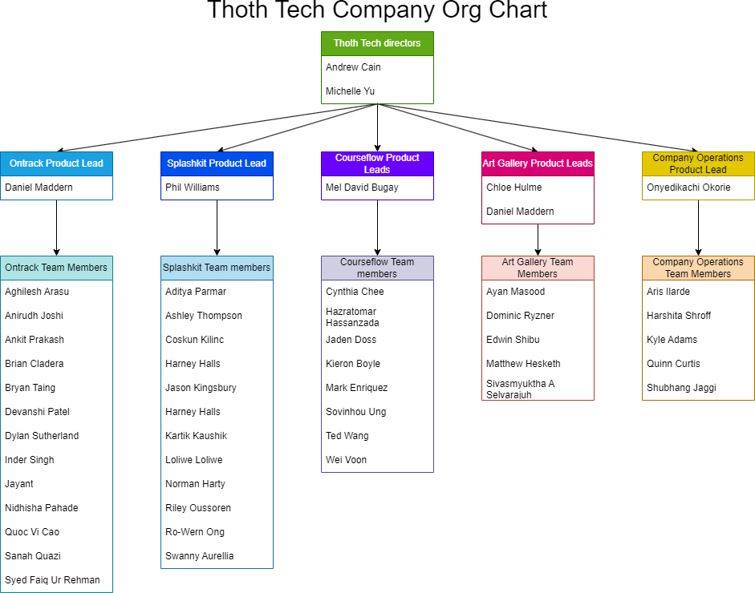

# Thoth Tech - Company Structure and Objectives for 2023 TRIMESTER 2

## Executive Summary

Thoth Tech is a software development company currently building from the ground up in Melbourne,
Australia.

Thoth Tech’s mission is to build, operate, and deploy education technologies, creating tools that
enhance education outcomes by empowering students, connecting them with tutors, and facilitating
personalised learning experiences.

We value our people, and we value excellence. We are people-focused, aiming to produce sustainable
products of excellent quality, and provide frameworks that supply a safe environment for learning
and support of our team.

This report is for stakeholders and investors, and will outline the company structure, charter,
objectives–both short and long term, and explore each product’s goals.

Thoth Tech has recruited approximately 63 employees with 5 product leads.

Thoth Tech currently runs with five products OnTrack, Courseflow, Splash Kit, Courseflow, and
Company Operations. The additional projects give a bit more variety to the technology stacks
currently in use and ties in nicely with some existing units that students are working on.

Company Operations oversees the entire affairs of Thoth Tech and strives to make things easier.
Effective operations are important for maintaining a successful business. As other product teams
focus to develop new features and upgrade existing products, we would be working to ensure that
appropriate industry guidelines and standards are followed to produce world class products. We
document the tools and processes that Thoth tech uses in its daily operations and research new
options that could serve the company better.

OnTrack is one of the bigger projects in the company and is a live production system that is in use
at Deakin University, it has been consistently improved and built upon to provide an exceptional
learning tool for students and staff at Deakin. Its technology stack consists of a Ruby on Rails
back end and an Angular JS / Angular 15 front end. There are a variety of projects to enhance and
upgrade this product that students can work on.

CourseFlow is a Thoth Tech product that was founded in T1 2023. It aims to assist students and
course directors in course planning and in comprehending the requirements of certain courses. It
does this by giving users a way to generate a personalized course map that meets the requirements of
their course and by providing a tool that allows users to view the requirements of all units (such
as prerequisite units) visually.

SplashKit is currently a 2D game development Software Development Kit used to teach object-oriented
coding to beginners. It has been identified that SplashKit can be expanded to explore other areas
and languages.

The Art Gallery Project is a new project that has been added in T1 2023, it is a web-based API back
end written in .NET 7 and C# on a PostgreSQL database and a Vue front end that was developed by
several students and a lecturer. The aim is to provide a system to track and sell Art works in
smaller communities.

## Table of Contents

### Leadership Team

#### Company Directors

- **Andrew Cain**, Managing Director
- **Glory Lee**, Managing Director

#### Student Leadership

- Daniel Maddern – Product Lead for OnTrack

- Daniel Maddern & Chloe Hulme – Product Lead for Art Gallery

- Mel David Bugay & Kieron Anthony Boyle – Product Leads for Courseflow

- Phil Williams – Product Lead for Splash Kit

- Onyedikachi Okorie - Product Lead for Company Operations

### Roles and Responsibilities

| Role                         | Description                                                                                                                                                                                                                                  | Responsibility                                                                                                                                                                                                                                                                                                                                                                                                                 | Skills                                                                                                                                                                     |
| ---------------------------- | -------------------------------------------------------------------------------------------------------------------------------------------------------------------------------------------------------------------------------------------- | ------------------------------------------------------------------------------------------------------------------------------------------------------------------------------------------------------------------------------------------------------------------------------------------------------------------------------------------------------------------------------------------------------------------------------ | -------------------------------------------------------------------------------------------------------------------------------------------------------------------------- |
| Managing Director            | The role of the managing director is to oversee the Thoth Tech company executive leadership team to ensure they are running the company effectively and value is being added to the Thoth Tech products by the projects they are supporting. | <ul> <li> Provide guidance to executive leadership team </li> <li> Provide high-level vision for the ongoing goals of the company.</li> <li> Provide a consistent company strategy due to low retention </li></ul>                                                                                                                                                                                                             | <ul> <li>Leadership</li> <li> Communication</li> <li> Mentor</li> <li> Decision-making</li> </ul>                                                                          |
| Product Lead                 | The role of the Product lead is to lead and support delivery leads in projects related to their product to ensure ongoing success.                                                                                                           | <ul> <li> Drive the product in the direction determined by the Managing Directors and Area Leads.</li> <li>Strong drive towards toward objectives with bias for action</li> <li> Proactively identify blockers and opportunities</li> <li> Support delivery leads where needed </li> <li> Make thoughtful decisions motivated by data and research</li><li> Be transparent and accountable by visualising objectives</li></ul> | <ul> <li>Leadership</li> <li> Communication</li> <li> Empathy</li><li>Interpersonal-Savvy </li><li> Collaborative</li><li>Stakeholder Management </li> </ul>               |
| Delivery Lead/Senior Student | The role of the Delivery lead is to lead, organise and support their project teams to ensure ongoing success.                                                                                                                                | <ul> <li> Establish a team cadence.</li> <li> Build rapport with all team members to foster a cohesive and collaborative environment</li> <li> Strong drive towards objectives with bias for action</li> <li> Proactively identify blockers and opportunities </li> </ul>                                                                                                                                                      | <ul> <li> Communication</li> <li> Empathy</li><li>Interpersonal-Savvy </li><li> Collaborative</li><li>Stakeholder Management </li> </ul>                                   |
| Team Member                  | The role of all team members is to contribute to their respective products/projects. Take the initiative in finding work and solving problems, as well as to communicate with the Seniors about their progress and issues.                   | <ul> <li> Work with the project leads to meet the goals for this trimester</li> <li>Attend to assigned tasks in a timely manner</li> <li> Work in collaboration with other team members to produce a viable product.</li> <li> Proactively identify blockers and opportunities </li> </ul>                                                                                                                                     | <ul> <li> Technical skills as per project</li> <li>Team collaboration</li> <li> Time Management </li> <li>Competence in GitHub</li><li>Knowledge of Agile model</li> </ul> |

### Trimester Goals and Objectives

Thoth Tech will aim to achieve the goals listed below:

#### Goal 1: Foster employees' growth in a safe and supportive environment to equip them with the soft and technical skills needed upon graduation

- Create an environment where the amount of work is distrusted evenly amongst roles and
  contributors.

- Utilise processes and tools that require collaboration and fosters growth such as Google Suite or
  Pull Reviews.

- Educate and Empower skill growth and knowledge sharing.

- Enhance onboarding experience for future employees.

- Ensure a supportive environment is provided for all employees regardless of race, gender, or other
  differences to allow every employee to thrive.

##### Goal 2: Extend the Existing Thoth Tech Applications based on the Director’s Visions

- Improve existing features of the Thoth Tech applications and extend the platforms.

- Have a mentality of self-improvement and find/squash bugs related to non-technical and technical
  issues.

- Maintain security guidelines and industry best standards.

- Embrace an ethic of communicating with non-technical stakeholders through diagrams and other
  methods of documentation to help future employees and investors.

##### Goal 3: Revise and Maintain Company Operations

- Improve existing company policies based on employee feedback and director advice.

- Educate future employees and develop a process to consider the bus factory.

- Allow company operations to be a smooth process for nurturing new company operation members.

- Establish documentation and guidelines to allow anyone to understand the company operation.

### Company Charter

The Thoth Tech charter is a crucial tool for guiding our team, navigating decisions, establishing
boundaries, and aligning the team on how we work together. It defines how as a company we work
together to achieve success.

Our charter comprises of the following:

1. Mission: As a team, what are we trying to achieve?

2. Values: What do we care about?

3. Team Culture: How will we work together, what do we expect?

4. Roles: What roles do we need and what are the responsibilities of each role?

5. Metrics of Success: What does success look like to us?

6. Standards of Quality: What are our standards for high quality work? Mission To build, operate and
   deploy world class education technologies.

This is achieved by creating tools that enhance education outcomes by empowering students,
connecting them with tutors and facilitating personalised learning experiences. Values Our values
describe how we work, what we represent, and guide us to be the kind of company and team members we
want to be. When we live up to these values we will: Be people-focused We expect the best from each
other, give each other the benefit of the doubt, encourage each other to take initiative to improve
ourselves and the company, and provide direct and constructive help to each other. We collaborate
with kindness while being respectful of each other. Uphold sustainable excellence We create working,
maintainable, and understandable software that is enjoyable and easy to use.

<!---->

We strive to do it in a way that is sustainable for our team members and for our environment. Be
inclusive and supportive We celebrate diverse perspectives and embrace uncomfortable ideas and
conversations. We facilitate an environment in which all team members feel psychologically safe
enough to make requests for what they need to do their job. We learn through failures while
continually working to make things better.

### Team Culture

1. Our employees will always operate with transparency and accountability.

2. We strive to always assume positive intent in our communication with each other.

3. We promote individual empowerment, with group support.

4. We achieve through iteration - progress before result is to be expected.

### Roles

1. Roles and responsibilities should be clearly defined.

2. Decision-making should be made based on company values and evidence.

### Metrics of Success

1. We take pride in our work.

2. We celebrate success regularly.

3. We collaborate and mentor with each other to share our learning.

4. We define our success.

5. We do not take shortcuts.

### Standards of Quality

1. Security and privacy are paramount.

2. Everything we do must be well documented for ourselves and for the future.

3. What we do should be easy to understand.

4. Build everything with re-usability and iteration in mind.

5. User satisfaction is key.

## Company Structure and Projects Overview

### Company Structure

## Projects Overview

### A. Company Operations

### Overview, Goals, and Objectives

This team oversees the entire operations of Thoth Tech and strives to make things easier. We aim to
make the onboarding process as smooth and clear as possible, as well as increase the knowledge of
our seniors in meaningful ways while creating policies to improve the wellbeing of all company
employees. In the short term, we would like to create new documentation, policies, workflows, and
processes that are relevant to improve the company’s outlook and overall productivity. In the long
term, we aim to store documentations in a dedicated website (Docusaurus) to make it easy to push
updates, new features, and bug fixes to everyone without the need to gain access to our GitHub
repository.

#### Projects

- **Documentation Website**: The goal of this project is to deliver a website that serves as a
  location for all company documents, this would help eradicate document management and retrieval
  issues ensuring everyone has full access to the documents they need to function in the company.

- **Policy creation**: The goal of this project is to create policies that would guide every member
  of Thoth Tech in using tools and technologies adopted by the company. This focuses on areas like
  GitHub, Trello, creating documents, using the Documentation website, and so on.

- **Documentation**: This involves documenting every work and activity necessary for project and
  business continuity. Every plan and outcome for a project is being documented and currently stored
  in the Company Operations GitHub repository, the end goal is for all documentation to be stored in
  the documentation website being created (Starlight).

##### Aims for Trimester

- Develop a policy for git-workflow.

- Create a policy for Trello and the processes associated with it.

- Describe and document the steps required to progress a change through a product.

- Introduce a new onboarding document for the Ontrack product.

- Explore the use of Docusaurus for storing documentation.

- Generate code standard to be used for all product deployment.

- Ensure group OnTrack tasks are completed to a satisfactory standard.

- Write a list of new tasks for the documentation team to begin building.

##### Deliverables

- Generated policies to be implemented by the company.

- Deploy Docusaurus for company use.

- Migrate all documentations to Docusaurus.

- Develop general standards for the company in all areas that apply.

##### Project Members

| Project Member           | Role         | Responsibilities                                                                       |
| ------------------------ | ------------ | -------------------------------------------------------------------------------------- |
| Onyedikachi Okorie       | Product Lead | Organize meeting, create technical documents, assign tasks to team members, and so on. |
| Quinn Curtis             | Team Member  | Work on assigned cards on Trello.                                                      |
| Aris Danielle Ilarde     | Team Member  | Work on assigned cards on Trello.                                                      |
| Kyle David Adams         | Team Member  | Work on assigned cards on Trello.                                                      |
| Shubhang Jaggi           | Team Member  | Work on assigned cards on Trello.                                                      |
| Harshita Narendra Shroff | Team Member  | Work on assigned cards on Trello.                                                      |

### B. OnTrack

#### Overview, Goals, and Objectives -

This trimester Ontrack will be working dynamically across a variety of projects. We will be working
based on a priority system to get as many useful changes implemented as possible in the trimester.

We will be breaking each project into smaller subcomponents to allow people to work across projects
in areas that are strong at or interested in. Everything should be completable in a 2- week sprint.

#### Projects-

- **Numbas Intergration** – We are integrating the Numbas mathematics tests into the Ontrack
  Workflow, so tests can be taken during the submission process and can be incorporated into the
  workflow to complete a submission based on passing or failing the test.

- **Migration Front End** – We have migrated a lot of our components to the later version of
  Angulars, however there still a range of components that need to be migrated to FX layout with
  Tailwind.

- **Terminators** – This a project to resolve bugs that are in the system, there are a few key ones
  we want to focus on first, and any additional bugs will also be added into this backlog.

- **Improvers** – This a project to enhance some of our existing features with new functionality,
  there are a range of different features we want to enhance.

- **Inventors** – This project is to scope out and start the build of new features we want including
  in the system, again there is a range of new features, and they are at various stages of
  development.

- **Data Analytics** – This project has taken a step back, we will be reviewing the progress last
  trimester and coming up with a new project plan and design on how we want to deliver this.

- **Attendance Module** – We want to create an attendance module; in that you can use SSO from
  different organisations like google/GitHub or other universities to log into the system.

#### Aims for Trimester-

- Complete the Numbas Integration into Ontrack

- Migrate legacy Angular components to FX layout with tailwind (Migrators)

- Feature enhancements (Terminators)

- Feature enhancers (Improvers)

- New Features (Inventors)

- Data Analytics - New project plan, review of previous work completed, New Project Aims document.

- Authentication module – Design and plan for the module to be built.

#### Deliverables-

Our main deliverables will be based on story points completed in the Trello tasks; we are aiming for
students to complete between 5-6 Story points every 2-week sprint.

#### Short Term Deliverables (This trimester)-

- Numbas integration completed.

- 50% of Angular migration completed.

- All bugs resolved.

- New features mapped out ready for next trimester.

- Review of Data Analytics and Plan to move it forward.

- Scope for Authentication Module

#### Long Term Deliverables (Ongoing)-

- All Angular migrations completed.

- Enhance features mapped out in Trimester.

- Develop new features.

- Create Data Analytics platform.

- Authentication Module created.

- Card Scan Attendance Project

#### Project Members-

| Project Member            | Role         | Responsibilities                            |
| ------------------------- | ------------ | ------------------------------------------- |
| Daniel Maddern            | Product Lead | Distribute Tasks, Implement Numbas project. |
| Dylan Sutherland          | Team Member  | Work on Trello tasks for various projects   |
| Inder Singh               | Team Member  | Work on Trello tasks for various projects   |
| Sanah Quazi               | Team Member  | Work on Trello tasks for various projects   |
| Devanshi Patel            | Team Member  | Work on Trello tasks for various projects   |
| Brian Caldera             | Team Member  | Work on Trello tasks for various projects   |
| Bryan Taung               | Team Member  | Work on Trello tasks for various projects   |
| Anirudh Nellippilli Joshi | Team Member  | Work on Trello tasks for various projects   |
| Syed Faiq Ur Rehman       | Team Member  | Work on Trello tasks for various projects   |
| Nidhisha Pahade           | Team Member  | Work on Trello tasks for various projects   |
| Quoc Vi Cao               | Team Member  | Work on Trello tasks for various projects   |
| AGHILESH ARASU            | Team Member  | Work on Trello tasks for various projects   |
| Jayant                    | Team Member  | Work on Trello tasks for various projects   |
| Ankit Prakash             | Team Member  | Work on Trello tasks for various projects   |

### C. Art Gallery

#### Overview, Goals, and Objectives-

The Art Gallery is a product being created to help sell and advertise rural Art in Australia. We
made some good progress last trimester and have some amended goals this trimester to move the
product forward. The key focuses this trimester will be about getting the system deployed with a
working knowledge base. So future work on the system can be easier we will also look at implementing
a CI/CD pipeline.

#### Projects -

This trimester we have a range of projects we are working on in the Art Gallery:

- **Deployment** – The aim this trimester is to get the base product deployed after researching the
  various deployment options (free tier).

- **CI/CD Pipeline** – We are also looking to investigate and implement a CI/Cd pipeline for the
  product to make future development work easier and cleaner.

- **Knowledge Base** – A lot of work has gone into designing and investigating the Knowledge base in
  Trimester 1 and we want to build this solution and populate it with the knowledge we already have.

- **IIIF Research** – Art Gallery need to adhere to specific standards and the format for the Art
  Gallery images should be IIIF, we will be researching and writing a report on the requirements to
  meet this standard.

- **Lighthouse implementations** – Last trimester we ran a project to test the system with Google
  Light house, the report outlined some of the areas we needed to improve, and we hope to make those
  changes this trimester.

- **Front end update** – Parts of the Vue front end are written in pure HTML/CSS, this need updating
  to make use of the Vue framework.

#### Aims for Trimester -

- Implement Knowledge base.

- Investigate and implement a CI/CD pipeline for the product.

- Implement changes based on Light house report from T1.

- Compare existing tech stack to Angular/Rails

- IIIF research and report for image standard

- Add additional testing (JavaScript testing)

#### Deliverables Short Term -

- Working Knowledge base with documentation uploaded

- Deployed system and Deployment process documentation

- CI/CD pipeline documented and live.

- IIIF research report

- Lighthouse report suggested changes.

- Front end conversion to Vue framework.

##### Long Term

- Full implement IIIF standard

- Test Current system against Angular/Rails build.

- Document the Knowledge base procedures and process for use.

#### Project Members -

| Project Member            | Role         | Responsibilities                                      |
| ------------------------- | ------------ | ----------------------------------------------------- |
| Chloe Hulme               | Product Lead | Manage the team and projects                          |
| Daniel Maddern            | Product Lead | Set up Trello and get the team started on their work. |
| Kyle David Adams          | Team Member  | Work on Trello tasks for various projects             |
| Dominic Robert Ryzner     | Team Member  | Work on Trello tasks for various projects             |
| Ayan Masood               | Team Member  | Work on Trello tasks for various projects             |
| Matthe Hesketh            | Team Member  | Work on Trello tasks for various projects             |
| Sivasmyuktha A Selvarajuh | Team Member  | Work on Trello tasks for various projects             |

### D. Courseflow

#### Overview, Goals, and Objectives:-

This project aims to assists students and course directors in course planning and in comprehending
the requirements of certain courses. It does this by giving users a way to generate a personalized
course map that meets the requirements of their course and by providing a tool that allows users to
view the requirements of all units (such as prerequisite units) visually.

#### Aims for Trimester :-

Our aim this trimester is to complete an MVP (Minimum Viable Product) for CourseFlow and deploy it
to a server. To achieve this, we need to design and implement key components which are detailed
under the deliverables section. Once the MVP is developed, the next step is to deploy it to a
server, making it accessible to users. This involves setting up the server infrastructure,
configuring the necessary software dependencies, and ensuring a smooth deployment process.

#### Deliverables -

##### Frontend

- Finalise the UI ‘CourseMap’ timetable generating page with TypeScript and Angular

- Connect the ‘CourseMap’ page with the Deakin/student data API.

- Create a UI for the ‘Discovery’ view page.

- Significant progress on the ‘Discovery’ view page and visualising the data.

##### Backend

- Get access to Deakin’s unit and course data, either through the private API used by
  StudentConnect, web-scraping the handbook site, or some other way.

- Create API endpoints in C#.

- Write unit tests for the main software components.

##### Miscellaneous

- Build up clear documentation of how the front end and backend.

- Implement a CI/CD pipeline.

- Deploy CourseFlow to a server.

- Potentially have user testing depending on the progress of the project

##### Documentation

- Write README.md files for CourseFlow GitHub
- Ensure GitHub and repository runs up to speed.
- Ensure proper naming conventions throughout the codebase.

Work with front-end and back-end to make diagrams and explanations of how the project works and
connects.

##### Project Members:-

| Project Member        | Role         | Responsibilities                         |
| --------------------- | ------------ | ---------------------------------------- |
| Mel David Bugay       | Product Lead | Back-end and project management          |
| Kieron Anthony Boyle  | Team Member  | Front-end and project management.        |
| Ted Wang              | Team Member  | Front-end and project management         |
| Onyedikachi Okorie    | Team Member  | CI/CD, Documentation, project management |
| Hazratomar Hassanzada | Team Member  | Documentation, Front-end                 |
| Jaden Doss            | Team Member  | Documentation                            |
| Mark Enriquez         | Team Member  | Front-end, back-end                      |
| Wei Min Voon          | Team Member  | Front-end documentation                  |
| Sovinhou Ung          | Team Member  | Back-end, front-end                      |
| Cynthia Yi Min Chee   | Team Member  |                                          |

### E. Splash Kit

#### Overview, Goals, and Objectives :-

Splashkit is a simple-to-use programming framework specialising in 2D games to help teach students
introductory programming through the development of games. The framework is primarily coded in C++
but can be used for C++, C#, Python, and Pascal.

#### Projects :-

- **Arcade Machines:** The university has purchased four Arcade machines that can be used to
  showcase games built-in SplashKit. The units run on a Rasberry Pi 3B+. Giving constraints and a
  target platform development. Our goal is to have this platform ready for students to show games
  developed using SplashKit by the Thoth Tech Splashkit team. In the long term, the aim is to have
  this platform available for first-year students with an easy-to-use process to upload their and
  test their games.

- **Tutorials:** As Splashkit is not a mainstream framework, there are fewer examples on how to use
  it effectively available online. Our aim is to create a small series of tutorials using game
  construction as the medium to convey how to use various SplashKit functions together.

- **SplashKit Expansion:** Splashkit framework was derived from a project called Swingame; in the
  original port, not all functions were moved across. The team will develop a roadmap reviewing what
  functions can be ported across and investigate new functions that can be added.

- **SplashKit Online:** A new project we wish to launch is SplashKit Online; the concept is to give
  students access to an IDE in a web browser and the ability to run their code in a web browser.

#### Aims for Trimester:-

1. This trimester's primary goal is to prepare the arcade machines for the Burwood open day,
   displaying students' work with playable demos.

2. Create at least two tutorials, showing how to use sprites and object interaction effectively.
   These areas will likely also be covered in the process of building an interactive game – Handel
   Inputs, Draw to window, Animations, Collision detection.

3. The team will review what functions can be ported, develop a roadmap create processes for
   contributing to Splashkit Framework, and investigate & manage bug reports.

4. Investigate and produce initial designs for how SplashKit Online can work.

#### Deliverables:-

1. **Arcade Machines**

#### Short Term

- Develop an Arcade machine menu system using Emulation Station as a base.

- Test and optimise existing games for the Arcade Machine.

  - Asteroids

  - DX Ball

  - Below The Surface

  - Runner Dash

- Add high score function to games.

- Update GitHub actions to allow C# games to be uploaded.

#### Long Term:-

- Define and automate the process for uploading games to machines.

- Create documentation defining requirements for running games on the arcade machines.

#### Tutorials

- **Short Term**

  - Complete and Refine 2D racer code base.

  - Create a Written Tutorial on working with Sprites (2D Racer)

    - Shot version Introducing and using sprites that can be put on Splashkit.io

    - More detailed step-by-step tutorial introducing how to build a game using sprites.

  - Outline the second game and tutorial focusing on sprite and game physic.

#### Long Term :-

- Continue and finish game two Tutorial.

- Explore additional areas where detailed tutorials would be of benefit in explaining how to use
  SplashKit APIs

#### SplashKit Expansion

- **Short Term**

  - Develop Roadmap

  - Learn and understand requirements for importing new functions to SplashKit

  - Port Functions

    - Collision Effect Application (angle + energy/mass transfer)

    - Circle Collide Test

#### Long Term :-

- Develop Issues(bug) management process.

- Look at further functions for Expansion.

  - AI and/or Chat GPT

  - Physics Engine

#### SplashKit Online

- **Short Term**

  - Perform the first stages of the Software Development Lifecycle (SDLC)

  - Planning, Analysis and Design

  - Investigate the viability of different approaches.

  - Develop Software Requirements Specification

  - Create code contribution standards using a test-driven approach.

#### Long Term :-

- Develop the platform using a container infrastructure (portable)

- Create continuous improvement continuous deployment pipeline.

- Host service

#### Project Members --

| **Project Member** | **Role**     | **Responsibilities**                 |
| ------------------ | ------------ | ------------------------------------ |
| Phil Williams      | Project Lead | Team management, Code, Documentation |
| Loliwe Loliwe      | Team Member  | Code,Documentation                   |
| Coskun Kilnic      | Team Member  | Code, Documentation                  |
| Norman Harty       | Team Member  | Code, Documentation                  |
| Riley Oussoren     | Team Member  | Code, Documentation                  |
| Harney Halls       | Team Member  | Code, Documentation                  |
| Norman Harty       | Team Member  | Code, Documentation                  |
| Ro-Wern Ong        | Team Member  | Code, Documentation                  |
| Ashley Thompson    | Team Member  | Code, Documentation                  |
| Kartik Kaushik     | Team Member  | Code, Documentation                  |
| Jason Kingsbury    | Team Member  | Code, Documentation                  |
| Aditya Parmar      | Team Member  | Code, Documentation                  |
| Ro-Wern Ong        | Team Member  | Code, Documentation                  |

## Progress to Each Project

## Product: Company Operations

### Documentation Website

Description of Progress

- Created high level prototypes for the website.

- Researched on documentation platforms that would meet Thoth Techs requirement.

- Created Spike plan and Outcomes for documentation Platforms.

- Picked Starlight as the documentation website.

- Deployed the landing page, products, process, and leadership page on Starlight.

- Researched on free web hosting platforms.

- Created Spike Outcome for Render as a Hosting platform.

- Researched Netlify as a free hosting platform.

- Successfully hosted documentation website on Netlify (still in staging phase).

#### Trello Card Overview

- Completed: 9

- Review: 1

- In progress: 6

- Backlog: 10

#### Changes to the Plan

Initially Docusaurus was considered as the platform to be used for building the website but after
considering different areas such as the inability to change its default layout, we investigated
other platforms and decided to go with Starlight as it met most of our requirements.

### Policy Creation

Description of Progress

Currently, a GitHub policy document and a guide on how to associate Trello cards with GitHub has
been published. Some students are still tasked with the creation of guidelines for creating
documentation and technology stacks used by Thoth Tech.

#### Trello Card Overview --

- Completed: 2

- Review: 0

- In progress: 1

- Backlog: 4

#### Changes to the Plan --

There have been no changes to the initial laid out plan, and we are continuously working to meet the
stated goal of this project.

### Documentation --

Description of Progress

The project is progressing smoothly as it has been enforced that every work done should be
documented and pushed to GitHub, the pull request that arises from requesting a merge to the
company’s main branch would then be used as evidence of work done by an individual. The documents
are all written in markdown and would soon been migrated from all products GitHub repository to
Starlight (documentation website).

#### Trello Card Overview :--

- Completed: 11

- Review: 0

- In progress: 1

- Backlog: 6

#### Changes to the Plan :--

There have been no changes to the initial laid out plan.

## Product: OnTrack

### Front End Migration

_Description of Progress_ All existing tasks in backlog allocated, below is the progress of the
current backlog.

- 21 tasks in backlog

- 8 pending upstream review.

- 3 pending local review

- 10 being worked on

We have a large portion of the team who have been involved with the front-end migration, it’s a very
popular choice.

#### Changes to the Plan ;--

More Migration tasks to be added into the backlog. Trying to finalize all the 21 that were in the
backlog back the end of trimester.

#### Urgent Enhancements

_Description of Progress_ We set some more valuable Trello tickets for urgent enhancements we wanted
working on this trimester.

#### WIP

- UI router enhancement

- Code space Testing

- Migrate Confirmation Model

- Convert PDF long lines

#### Changes to the Plan:---

There have been a few difficulties with some of these projects, UI router enhancement doesn’t accept
external pull requests, so we are waiting for contact from them to get the change pushed in.

### Numbas

Description of Progress

- Discussion with Numbas on how to proceed

- Abstract LMS functionality to its own service

- Spike understanding SCORM 2004 functionality

- Created Backend End Point in PoC

- Setup MariaDB in PoC

- Setup Schema for save test functionality

- Saving test as PDF in PoC

- Created Angular Service to work with new Endpoint in PoC

- Updated SCORM from 1.1 to 2004 V3

- Updated UML for new feature

#### WIP:--

- Adjusting functionality to save and resume tests as needed

#### Changes to the Plan ;-

Some delays after speaking to Numbas due to changing SCORM version and getting the resume test
working, currently working on final PoC task before starting build in main system. The main issue is
getting the logic correct for the order of checking existing tests/creating new tests.

## Data Analytics

Description of Progress

- Review of existing data analytics work from previous trimesters

- Spike to analyze the previous work

- Backlog created for progressing this project

- Research spike on data analytic tools.

### Changes_to_Plan:-

This project is on hold until we can establish the business outcomes required for this project.

### Inventors

This is a backlog for creating new features, firstly by creating a backlog for that new feature so
that other students can work on it.

Description of Progress

- Staff Grant Extensions Backlog created

- Incorporate Content Backlog created

#### WIP:-

- Grant Staff extensions Requirements and Design

- Create UML for Incorporate content

- Incorporate Content Design and requirements

#### Changes to Plan

To ensure the new features meet the requirements of the company, there have been some back-and-forth
reviews and design changes which have slowed some of the progress down.

## Product: SplashkKit

### Arcade Machines

Description of Progress

- Image for Arcade machine built and tested

  - Include Theemed Menu System

  - Access Point with SSH and SMB access

  - Auto boot

- 3 Games are ready for display

  - Asteroids

  - Below the Surface

  - DX Ball

#### Changes to the Plan:-

- Further focus on polishing our display titles there are some minor additions that would be great
  for each.

- Fork and modify Emulation Station (Menu System) so it can be adjusted to better suit our purposes
  beyond open day.

  - Integrate game upload ability.

### Tutorials:-

Description of Progress

- Several tutorial outlines complete

- _Created Documentation Standards_

- Getting Started with Sprites Tutorial Complete(C#).

- Using Sprite Event Handlers Toturial Complete(C#)

#### Changes to the Plan:--

- _Single Function Tutirials to be intergraded into
  [<u>https://splashkit.io</u>](https://splashkit.io/)_

### Splashkit Expansion

Description of Progress

- Fix Sprite collision function

- Windows installation using WSL guide written

#### Changes to the Plan :---

- _Add Creation of Dev Contatin for Splashkit_

- Create Debian and Brew packages for Installing Splashkit

- Create Nuget package for using Splaskit in C#
<!---->

### SplashKit Online:-

Description of Progress

- Requirements Document Complete.

- Mockup for Landing Page, and Code Editor.

- Prototype Login Page

#### Changes to the_Plan

- Aim to have splash kit GUI rendered in a browse.

- Try and Produce MVP

## Product: Art Gallery Indigenous Art Gallery

Description of Progress: Project is on hold.

### Change to Plan

Our goals have changed from 2.1P as we are no longer planning to deploy the product this trimester.
We are instead focusing on developing a robust deployment strategy as well as a set of guidelines
for future cohorts to deploy our product effectively. We are also continuing to focus on enhancing
the front and back ends of our product in line with suggestions made by our client.

### Deployment

Description of Progress

We have completed documentation on different types of deployment strategies and selected GCP and
GitHub Actions as our preferred tools. Additionally, we have completed the preliminary proposal for
using GCP to deploy the application, and the cybersecurity steps needed to ensure all collaborators
use GCP safely and securely. We are currently researching GitHub Actions for CI/CD development and
different checks to be used by the team. The paperwork required for us to be granted permission to
use GCP as our deployment platform has been prepared and submitted by Chloe, and we are currently
waiting to hear back.

### Change to the Plan :--

After completing research on different types of deployment Ayan was assigned to research more of
these strategies. After liaising with stakeholders, we selected GCP as our preferred tool, and so we
halted our continued research into other deployment strategies. Ayan was then required to make a
proposal and cybersecurity policy for the team to be granted access to GCP. Ayan initially ran into
some issues with Prettier when submitting documents to our repo, so Chloe submitted his work on his
behalf - please note he must be credited with this
[PR](https://github.com/thoth-tech/documentation/pull/317).

### Backend Enhancements

Description of Progress

The backend enhancements project within the Indigenous Art Gallery product has made several strides
within the first half of the trimester. Namely, the API has been migrated to .NET 8.1, and the
Docker containers have been rebuilt for this change to come into effect. Documentation relating to
these changes has been modified to mention the change (README files). Additionally, a preliminary
proposal was put forward prior to the migration, which discusses the breaking changes we can expect
to look out for, as well as recommending

enhancements available to us in .NET 8. An additional proposal has been put forward documenting the
benefits of implementing asynchrony in our API. It also includes an action plan for implementing
asynchrony in our RP implementation in our API, which will be completed over the remainder of the
trimester.

### Changes to the overall Plan:--

Where the backend enhancements project deviated from the initial plan was by creating a Postman
workspace for the team to use. This is helpful in streamlining the testing of our API, as well as
automating some of our testing. So far, 33 automated tests have been created to validate the
behavior of the API. This was due to be created at the end of the trimester, but we decided it would
be more beneficial to create this upfront, to facilitate the testing of our asynchrony
implementation. A README style file has been created as guidelines on how the company should proceed
with using this platform.

### IIIF

Description of Progress

So far, we have been able to research what IIIF is and what it is capable of achieving and if it is
beneficial for the Art Gallery. Dominic has also completed a basic course on what IIIF is in more
technical aspect as well as how to convert an image into a IIIF format for viewing on a universal
viewer. For the rest of the trimester, Dominic will be implementing the IIIF into the Art Gallery
Project.

#### Change to Plan:-

No changes have been made to the plan. Dominic is continuing to work on implementing IIIF, after
having up-skilled by completing a course, and having produced research documentation in the first
sprint.

### Lighthouse Implementations

Description of Progress

We have done a full review of the lighthouse project from the previous trimester and set up an
action plan for components to be implemented from the report. Currently, Sivasamyuktha

is upskilling in JavaScript, HTML, CSS, and the use of Git. For the duration of the trimester, we
will be working on JavaScript and website-related tasks to help improve Lighthouse scores.

#### Changes to the \_Plan:-

No changes at this stage.

##### Frontend Enhancements

Description of Progress

The front-end team have redesigned our logo, as well as having sorted through the code base to
determine which areas need to be upgraded (pure HTML to Vue components). They have created a backlog
of these changes and began to implement them.

#### Changes \_to the Plan

No changes at this stage.

## Product: Courseflow

### Frontend – Unit discovery page

Description of Progress

- We now have working prototypes demonstrating the key features of the webpage that allows users to
  find information about related units easily by displaying them as a network using the d3js
  library.

- Unit data is currently sourced from data extracted from Deakin’s 2019 handbook PDFs.

#### Changes to\_ the Plan

No significant changes to the original plan.

### Frontend – 2 Factor Authentication

Description of Progress

Figma design on the 2FA web page, aligning navigation bar and others to another front-end project to
stay consistent. At the same time developing the webpage based on the design using TypeScript as a
part of coding language.

#### Changes to the Plan\_:-

Future changes maybe design wise, and further impact on the code/html webpage.

### Frontend – Coursemap UI redesign

Description of Progress

Development with Angular underway:

- Various components for the front-end have been developed.

- Components have been developed so that will load information dynamically if they are fed relevant
  JSON data.

Redesign largely finished:

- The UI redesign has been largely finished. Various iterations have been complete and the final
  result is much more intuitive than the initial design.

- Final segment to be complete is the exact navigation for a side menu, however the current planned
  design is in development.

Unit and course data has been obtained:

- A JSON file with information for various courses as well as units has been obtained. This can be
  used alongside the previous data scraped JSON files.

- This has been split into sub files relevant to specific courses. Therefore, only the required JSON
  file needs to be accessed for a course.

#### Changes to the Plan\_\_:-

- More time than expected was spent on the redesign process

- New team members have taken longer than expected to upskill on Angular, this has limited the
  number of members that have been able to work on technical contributions.

- The exact MVP for the end of the trimester has been refined to displaying information related to
  the 2023 ‘Bachelor of Computer Science’

### General/documentation

Description of Progress

- RESTful API endpoints have been defined and implemented.

- Received unit and course data from a course director. Further analysis of the data received will
  be required to determine how to best use them.

- Early research into Dockerisation of the dev environment is complete. WIP container for front-end
  environment is complete. In the future we will need to add the development environment for the
  backend as well to the container.

- Trello board integration with GitHub added

- GitHub Contribution.md and README.md files created

#### Changes to the original Plan

No significant changes to the original plan.

#### Team Members and Their Key Achievements

##### Product: Company Operations-

| Key Achievements (Pull Request links)                                                                                                                                                                                                                                                                                                                                                                                                                                                                                                                                                                                                                                                                                                                                                                                                                                                                                                                                                                                                                                                                                                                                                                                                                                                                                                                                                                                                                                                                                                                                                                                                                                                                                                                                                                                                                                                                                                                                                                                                                                                                                                                                                                                                                                                                                                                               | Team Member        |
| ------------------------------------------------------------------------------------------------------------------------------------------------------------------------------------------------------------------------------------------------------------------------------------------------------------------------------------------------------------------------------------------------------------------------------------------------------------------------------------------------------------------------------------------------------------------------------------------------------------------------------------------------------------------------------------------------------------------------------------------------------------------------------------------------------------------------------------------------------------------------------------------------------------------------------------------------------------------------------------------------------------------------------------------------------------------------------------------------------------------------------------------------------------------------------------------------------------------------------------------------------------------------------------------------------------------------------------------------------------------------------------------------------------------------------------------------------------------------------------------------------------------------------------------------------------------------------------------------------------------------------------------------------------------------------------------------------------------------------------------------------------------------------------------------------------------------------------------------------------------------------------------------------------------------------------------------------------------------------------------------------------------------------------------------------------------------------------------------------------------------------------------------------------------------------------------------------------------------------------------------------------------------------------------------------------------------------------------------------------------- | ------------------ |
| <ul> <li>Created Company Operations repository on Thoth Techs GitHub account and created a folder structure. [https://github.com/thoth-tech/Company-Operations/pull/1](https://github.com/thoth-tech/Company-Operations/pull/1) </li> <li> Generated a guideline on how to associate Trello cards with GitHub. [add-github-actions-to-trello by Kachi-Okorie · Pull Request #2 · thoth-tech/Company-Operations](https://github.com/thoth-tech/Company-Operations/pull/2)</li> <li> Converted 2.1P Task to markdown and published on GitHub [Add Company Catalogue -KO by Kachi-Okorie · Pull Request #4 · thoth- tech/Company-Operations (github.com)](https://github.com/thoth-tech/Company-Operations/pull/4)</li> <li> Create an Issues Resolution folder and updated it with issues faced with found resolution. [Add-Issue-Resolutions-KO by Kachi-Okorie · Pull Request #5 · thoth-tech/Company-Operations (github.com)](https://github.com/thoth-tech/Company-Operations/pull/5)</li> <li> Created a hosting plan for Docusaurus and performed a test on Render (a web hosting platform). [Docusaurus Hosting Plan & Render Outcome - KO by Kachi-Okorie · Pull Request #7 · thoth-tech/Company-Operations (github.com)](https://github.com/thoth-tech/Company-Operations/pull/7)</li> <li> Created GitHub Management policy. [GitHub Company Policy-KO by Kachi-Okorie · Pull Request #10 · thoth-tech/Company-Operations](https://github.com/thoth-tech/Company-Operations/pull/10)</li> <li> Created a folder for Starlight project and populated it with the folders, templates, modules, and other resources required to create the documentation website. [Add-Starlight-Project-KO by Kachi-Okorie · Pull Request #11 · thoth-tech Company-Operations (github.com)](https://github.com/thoth-tech/Company-Operations/pull/11)</li> <li> Added the Process, Teams, and leadership pages on Starlight.[Adding teams n leadership page to Starlight - KO by Kachi-Okorie · Pull Request #14 · thoth-tech/Company-Operations (github.com)](https://github.com/thoth-tech/Company-Operations/pull/14)</li> <li> Created logo for Company Operations. [Company-Operations/images/CompanyOps-logo.png at main · thoth-tech/Company-Operations (github.com)](https://github.com/thoth-tech/Company-Operations/blob/main/images/CompanyOps-logo.png)</li></ul> | Onyedikachi Okorie |
| <ul> <li> Created Spike documentations for using Docusaurus as a documentation website. [Docusaurus research by QuinnCurtis02 ·Pull Request #3 · thoth-tech/Company-Operations (github.com)](https://github.com/thoth-tech/Company-Operations/blob/main/images/CompanyOps-logo.png)</li> <li> Researched on various documentation platforms to determine the one that meets Thoth Techs requirement.[Add documentation platform research by QuinnCurtis02 · Pull Request #13 · thoth-tech/Company-Operations (github.com)](https://github.com/thoth-tech/Company-Operations/pull/13)</li> <li> Created Starlight landing page and product page. [added home page and products to starlight by QuinnCurtis02 · Pull Request #15 · thoth-tech/Company-Operations (github.com)](https://github.com/thoth-tech/Company-Operations/pull/15)</li> </ul>                                                                                                                                                                                                                                                                                                                                                                                                                                                                                                                                                                                                                                                                                                                                                                                                                                                                                                                                                                                                                                                                                                                                                                                                                                                                                                                                                                                                                                                                                                                   | Quinn Curtis       |
| <ul> <li> Documented learnings from investigating various documentation platforms. [Docs: knowledge base prior learning and test documentation by Kyle-Dav · Pull Request #9 · thoth-tech/Company-Operations (github.com)](https://github.com/thoth-tech/Company-Operations/pull/9)</li> <li> Improved the side navigation bars on Starlight. [updated starlight config for sidebar -KA by Kyle-Dav · Pull Request #16 · thoth-tech/Company-Operations (github.com)](https://github.com/thoth-tech/Company-Operations/pull/16)</li> </ul>                                                                                                                                                                                                                                                                                                                                                                                                                                                                                                                                                                                                                                                                                                                                                                                                                                                                                                                                                                                                                                                                                                                                                                                                                                                                                                                                                                                                                                                                                                                                                                                                                                                                                                                                                                                                                           | Kyle Adams         |

<!---->

##### Product: OnTrack-

| Key Achievements (Pull Request links)                                                                                                                                                                                                                                                                                                                                                                                                                                                                                                                                                                                                                                                                                                                                                                                                                                                                                                                                                                                                                                                                                                                                                                                                                                                                                                                                                                                                                                                                               | Team Member         |
| ------------------------------------------------------------------------------------------------------------------------------------------------------------------------------------------------------------------------------------------------------------------------------------------------------------------------------------------------------------------------------------------------------------------------------------------------------------------------------------------------------------------------------------------------------------------------------------------------------------------------------------------------------------------------------------------------------------------------------------------------------------------------------------------------------------------------------------------------------------------------------------------------------------------------------------------------------------------------------------------------------------------------------------------------------------------------------------------------------------------------------------------------------------------------------------------------------------------------------------------------------------------------------------------------------------------------------------------------------------------------------------------------------------------------------------------------------------------------------------------------------------------- | ------------------- |
| <ul> <li>Spike into SCORM 2004. [https://github.com/thoth-tech/documentation/pull/316](https://github.com/thoth-tech/Company-Operations/pull/1) </li> <li> Abstract LMS functions. [https://github.com/thoth-tech/NumbasPoC/pull/1](https://github.com/thoth-tech/NumbasPoC/pull/1)</li> <li> UML for Numbas integration. [https://lucid.app/lucidchart/d05cab44-b8c8-40aa-b45c- bb35e5f0b431/edit?page=sVtI9-tn~WuS#](https://lucid.app/users/login?returnUrlOverride=%2Flucidchart%2Fd05cab44-b8c8-40aa-b45c-bb35e5f0b431%2Fedit%3Fpage%3DsVtI9-tn%7EWuS#/login?referredProduct=lucidchart)</li> <li> Add MariaDB and new Save Test Endpoint. [https://github.com/thoth-tech/NumbasPoC/pull/4](https://github.com/thoth-tech/NumbasPoC/pull/4)</li> <li> Resume test string save to DB. [https://github.com/thoth-tech/NumbasPoC/tree/configure-save- test-fe](https://github.com/thoth-tech/NumbasPoC/tree/configure-save-test-fe)</li> <li> Video Guide setting up Ontrack. [https://video.deakin.edu.au/media/t/1_6degiyrj](https://video.deakin.edu.au/media/t/1_6degiyrj)</li> <li> Save Test as PDF testing. [https://github.com/thoth-tech/NumbasPoC/tree/feat%2Fdownloadnumbastest](https://github.com/thoth-tech/NumbasPoC/tree/feat%2Fdownloadnumbastest)</li> </ul>                                                                                                                                                                                                                                    | Daniel Maddern      |
| <ul> <li> Changed fx-layout to tailwind equivalence for hero-sidebar. [https://github.com/thoth-tech/doubtfire-web/pull/63](https://github.com/thoth-tech/doubtfire-web/pull/63)</li> <li> Changed fx-layout to tailwind equivalence for sign-in. [https://github.com/thoth-tech/doubtfire-web/pull/64](https://github.com/thoth-tech/doubtfire-web/pull/64)</li> <li> Changed fx-layout to tailwind equivalence for user-badge. [https://github.com/thoth-tech/doubtfire-web/pull/65](https://github.com/thoth-tech/doubtfire-web/pull/65)</li> <li> Changed fx-layout to tailwind equivalence for footer. [https://github.com/thoth-tech/doubtfire-web/pull/66](https://github.com/thoth-tech/doubtfire-web/pull/66)</li> <li> Changed fx-layout to tailwind equivalence for audio-player. [https://github.com/thoth-tech/doubtfire-web/pull/66](https://github.com/thoth-tech/doubtfire-web/pull/66)</li> <li>Changed fx-layout to tailwind equivalence for intelligent discussion player. [https://github.com/thoth-tech/doubtfire-web/pull/75](https://github.com/thoth-tech/doubtfire-web/pull/75)</li> <li>Changed fx-layout to tailwind equivalence for intelligent discussion dialogue. [https://github.com/thoth-tech/doubtfire-web/pull/74](https://github.com/thoth-tech/doubtfire-web/pull/74)</li> <li>Changed fx-layout to tailwind equivalence for discussion prompt-composer. [https://github.com/thoth-tech/doubtfire-web/pull/73](https://github.com/thoth-tech/doubtfire-web/pull/73)</li></ul> | Syed Faiq Ur Rehman |
| <ul> <li>Created the backlog for the new feature “staff grant extension”. [https://trello.com/c/DX4rULDZ](https://trello.com/c/DX4rULDZ)</li> <li>Created the requirements document for the new feature. [https://github.com/thoth-tech/documentation/pull/335](https://github.com/thoth-tech/documentation/pull/335)</li> <li>Created the design document for the new feature. [https://github.com/thoth-tech/documentation/pull/357](https://github.com/thoth-tech/documentation/pull/357)</li></ul>                                                                                                                                                                                                                                                                                                                                                                                                                                                                                                                                                                                                                                                                                                                                                                                                                                                                                                                                                                                                              | Brian Caldera       |
| <ul> <li>Created a backlog for the new feature called ‘Incorporate content in Ontrack.’ </li> <li>Some of the cards from the backlog are currently in ‘Code Review’ section. </li> <li>And other cards from the backlog are in the ‘Sprint 2 Doing’ section. </li> <li>Created a document which outlines what needs to be done for the new feature. [https://github.com/thoth-tech/documentation/pull/338](https://github.com/thoth-tech/documentation/pull/338)</li> <li>Created a gather requirements document for the new feature. [https://github.com/thoth-tech/documentation/pull/353](https://github.com/thoth-tech/documentation/pull/353)</li></ul>                                                                                                                                                                                                                                                                                                                                                                                                                                                                                                                                                                                                                                                                                                                                                                                               | Devanshi Patel      |
| <ul> <li>Working on Fixing pdf generation, so it doesn’t break when submit code with a very long line. [https://github.com/thoth-tech/doubtfire-api/pull/4](https://github.com/thoth-tech/doubtfire-api/pull/4)</li></ul>                                                                                                                                                                                                                                                                                                                                                                                                                                                                                                                                                                                                                                                                                                                                                                                                                                                                                                                                                                                                                                                                                                                                                                                                                                                                                           | Bryan Taing         |
| <ul> <li>Replace fx-layout with tailwind equivalent - calendar-modal Pull Request: [https://github.com/thoth-tech/doubtfire-web/pull/80](https://github.com/thoth-tech/doubtfire-web/pull/80)</li> <li>Replace fx-layout with tailwind equivalent - staff-task-list Pull Request: [https://github.com/thoth-tech/doubtfire-web/pull/79](https://github.com/thoth-tech/doubtfire-web/pull/79)</li> <li>Replace fx-layout with tailwind equivalent - microphone- tester Pull Request: [https://github.com/thoth-tech/doubtfire-web/pull/78](https://github.com/thoth-tech/doubtfire-web/pull/78)</li> <li>Replace fx-layout with tailwind equivalent -task-dashboard Pull Request: [https://github.com/thoth-tech/doubtfire-web/pull/81](https://github.com/thoth-tech/doubtfire-web/pull/81)</li></ul>                                                                                                                                                                                                                                                                                                                                                                                                                                                                                                                                                                                                                                                                                                               | Quoc Vi             |
| <ul> <li>Created Data Analytics Backlog. </li></ul>                                                                                                                                                                                                                                                                                                                                                                                                                                                                                                                                                                                                                                                                                                                                                                                                                                                                                                                                                                                                                                                                                                                                                                                                                                                                                                                                                                                                                                            | Dylan Sutherland    |
| <ul> <li>I am delighted to share updates on recent achievements and ongoing tasks. Completed projects include researching analytics tools and enhancing OnTrack's homepage design with Tailwind CSS. Trello Cards: <li>Report on data analytics tools</li><li> Replace flex-layout with tailwind equivalent – home page. </li><li>[https://github.com/thoth-tech/doubtfire-web/pull/72](https://github.com/thoth-tech/doubtfire-web/pull/72)</li> <li> [https://github.com/thoth-tech/documentation/pull/352](https://github.com/thoth-tech/documentation/pull/352)</li></ul>                                                                                                                                                                                                                                                                                                                                                                                                                                                                                                                                                                                                                                                                                                                                                                                                                                                                                                                                       | Inderdeep Singh     |
| <ul> <li>Replaced fx-layout with tailwind equivalent for task- comment-composer Pull Request: [https://github.com/thoth-tech/doubtfire-web/pull/69](https://github.com/thoth-tech/doubtfire-web/pull/69)</li> <li>Replaced fx-layout with tailwind equivalent for extension comment - Pull Request: [https://github.com/thoth-tech/doubtfire-web/pull/70](https://github.com/thoth-tech/doubtfire-web/pull/70)</li> <li>Replaced fx-layout with tailwind equivalent for edit-profile form - Pull Request: [https://github.com/thoth-tech/doubtfire-web/pull/77](https://github.com/thoth-tech/doubtfire-web/pull/77)</li></ul>                                                                                                                                                                                                                                                                                                                                                                                                                                                                                                                                                                                                                                                                                                                                                                                                                                                                                      | Jayant              |
| <ul> <li>Designed a way to enhance group task submission [https://github.com/thoth-tech/documentation/pull/356](https://github.com/thoth-tech/documentation/pull/356)</li> <li>Design feature to incorporate new content on OnTrack (changes in progress) [https://github.com/thoth-tech/documentation/pull/355](https://github.com/thoth-tech/documentation/pull/355)</li></ul>                                                                                                                                                                                                                                                                                                                                                                                                                                                                                                                                                                                                                                                                                                                                                                                                                                                                                                                                                                                                                                                                                                                                    | Sanah Quazi         |

<!---->

##### Product: SplashKit-

| Key Achievements (Pull Request links)                                                                                                                                                                                                                                                                                                                                    | Team Member      |
| ------------------------------------------------------------------------------------------------------------------------------------------------------------------------------------------------------------------------------------------------------------------------------------------------------------------------------------------------------------------------ | ---------------- |
| [Documents for Setting up an Arcade Machine #341](https://github.com/thoth-tech/documentation/pull/341)                                                                                                                                                                                                                                                                  | Phil Williams    |
| [Game Concept Tutorial, 2D racer design tutorial and features (to add and keep) - MD file](https://github.com/thoth-tech/SplashKit-Tutorial/pull/2)                                                                                                                                                                                                                      | Harney Halls     |
| [Splashkit theme for the arcade machine / installation guide](https://github.com/thoth-tech/documentation/pull/361)                                                                                                                                                                                                                                                      | Riley Oussoren   |
| [Added Sprite Event Handler tutorial + demo Kcb demo](https://github.com/coskun-kilinc/documentation/pull/3)                                                                                                                                                                                                                                                             | Ro-Wern Ong      |
| <ul><li> [Asteroids Optimisation](https://github.com/thoth-tech/Asteroids/pull/2)</li><li> [Documentation Standards](https://github.com/thoth-tech/documentation/pull/319)</li> <li> [New Game SRS](https://github.com/thoth-tech/documentation/pull/323)</li> </ul>                                                                                                     | Josh Kilnc       |
| [documentation/docs/Splashkit/Applications/Arcade Machines/Research & Findings/Alternative_Retropie.md at main · LoliweLoliwe/documentation (github.com)](https://github.com/LoliweLoliwe/documentation/blob/main/docs/Splashkit/Applications/Arcade%20Machines/Research%20%26%20Findings/Alternative_Retropie.md)                                                       | Loliwe Loliwe    |
| <ul><li> [Getting Started With Sprites / Sprite Layering Proposal](https://github.com/thoth-tech/documentation/pull/326)</li> <li>[Getting Started With Splashkit - Windows Tutorial Proposal](https://github.com/thoth-tech/documentation/pull/320)</li></ul>                                                                                                           | Ashley Thompson  |
| [WSL installation guide Troubleshoot FAQ](https://github.com/thoth-tech/documentation/pull/364)                                                                                                                                                                                                                                                                          | Aditya Parmar    |
| <ul><li> [Remap control keys #84](https://github.com/thoth-tech/arcade-games/pull/84)</li> <li> [Key Codes Tutorial Proposal #330](https://github.com/thoth-tech/documentation/pull/330)</li> <li> [Mouse Button tutorial proposal #354](https://github.com/thoth-tech/documentation/pull/354)</li></ul>                                                                 | Swanny Aurellia  |
| [https://github.com/thoth-tech/SplashkitOnline/pull/4](https://github.com/thoth-tech/SplashkitOnline/pull/4)                                                                                                                                                                                                                                                             | Sherap Thakur    |
| <ul><li> [Update README.md by Anshuman0029 · Pull Request #1 · thoth- tech/SplashkitOnline (github.com)](https://github.com/thoth-tech/SplashkitOnline/pull/1)</li><li> [added the google verification for online splashkit by Anshuman0029 · Pull Request #3 · thoth-tech/SplashkitOnline (github.com)](https://github.com/thoth-tech/SplashkitOnline/pull/3)</li></ul> | Anshuman Bishnoi |
| <ul><li>[Below The Surface Game Test Report](https://github.com/thoth-tech/documentation/pull/369)</li> <li>[Asteroids Game Test Report](https://github.com/thoth-tech/documentation/pull/367)</li></ul>                                                                                                                                                                 | Wenxuan Song     |
| [Add scoreboard to DXBallGame](https://github.com/thoth-tech/arcade-games/pull/85)                                                                                                                                                                                                                                                                                       | Norman Harty     |

##### Product: Art Gallery-

| Key Achievements (Pull Request links)                                                                                                                                                                                                                                                                                                                                                                                                                                                                                                                                                                                                                                                                                                                                                                                                                                                                                                                                                                                                                                                 | Team Member               |
| ------------------------------------------------------------------------------------------------------------------------------------------------------------------------------------------------------------------------------------------------------------------------------------------------------------------------------------------------------------------------------------------------------------------------------------------------------------------------------------------------------------------------------------------------------------------------------------------------------------------------------------------------------------------------------------------------------------------------------------------------------------------------------------------------------------------------------------------------------------------------------------------------------------------------------------------------------------------------------------------------------------------------------------------------------------------------------------- | ------------------------- |
| <ul><li>[Deployment Strategy Research - PR #317 - thoth- tech/documentation](https://github.com/thoth-tech/documentation/pull/317)</li><li>[GCP Cybersecurity policy - PR #337 - thoth-tech/documentation](https://github.com/thoth-tech/documentation/pull/337)</li></ul>                                                                                                                                                                                                                                                                                                                                                                                                                                                                                                                                                                                                                                                                                                                                                                                                            | Ayan Masood               |
| <ul> <li>[Initial Migration to .NET 8 - PR #11 - thoth-tech/art-gallery](https://github.com/thoth-tech/art-gallery/pull/11)</li> <li>[.NET 8 Migration Report - PR #329 - thoth-tech/documentation](https://github.com/thoth-tech/documentation/pull/329)</li> <li>[CI/CD Tool Research Report - PR # 318 - thoth-tech/documentation](https://github.com/thoth-tech/documentation/pull/318)</li> <li>[Update to .NET 8 Migration Report - PR #336 - thoth- tech/documentation](https://github.com/thoth-tech/documentation/pull/336)</li> <li>[Postman Creation Report - PR #358 - thoth-tech/documentation](https://github.com/thoth-tech/documentation/pull/358)</li> <li>[API Asyncrhony Integration Report - PR #339 - thoth- tech/documentation](https://github.com/thoth-tech/documentation/pull/339)</li> <li>[Fixing RP API Errors - PR #12 - thoth-tech/art-gallery](https://github.com/thoth-tech/art-gallery/pull/12)</li> <li>[Mid-Tri Deployment Progress Update - PR #359 - thoth- tech/documentation](https://github.com/thoth-tech/documentation/pull/359)</li> </ul> | Chloe Hulme               |
| [IIIF Research and Course Review - PR #360 - thoth- tech/documentation](https://github.com/thoth-tech/documentation/pull/360)</li> </ul>                                                                                                                                                                                                                                                                                                                                                                                                                                                                                                                                                                                                                                                                                                                                                                                                                                                                                                                                              | Dominic Robert Ryzner     |
| [Lighthouse Report Review and Plan for Implementation/Upskilling - PR #363 - thoth-tech/documentation](https://github.com/thoth-tech/documentation/pull/363)</li> </ul>                                                                                                                                                                                                                                                                                                                                                                                                                                                                                                                                                                                                                                                                                                                                                                                                                                                                                                               | Sivasmyuktha A Selvarajuh |
| <ul><li>[UCD Research Report - PR #366 - thoth-tech/documentation](https://github.com/thoth-tech/documentation/pull/366)</li> <li> [Updates to Index.html - PR #19 - thoth-tech/art-gallery](https://github.com/thoth-tech/art-gallery/pull/19/checks)</li></ul>                                                                                                                                                                                                                                                                                                                                                                                                                                                                                                                                                                                                                                                                                                                                                                                                                      | Avenue Joju               |
| [https://www.figma.com/file/eazKFAsupKNrpqw0mfEsV6/Logo---Art-Gallery?type=design&node-id=0%3A1&mode=design&t=vke3ep1pVPBga4WR-1](https://www.figma.com/file/eazKFAsupKNrpqw0mfEsV6/Logo---Art-Gallery?type=design&node-id=0-1&mode=design)                                                                                                                                                                                                                                                                                                                                                                                                                                                                                                                                                                                                                                                                                                                                                                                                                                           | Edwin Shibu               |
| [https://www.figma.com/file/eazKFAsupKNrpqw0mfEsV6/Logo---Art-Gallery?type=design&node-id=0-1&mode=design](https://www.figma.com/file/eazKFAsupKNrpqw0mfEsV6/Logo---Art-Gallery?type=design&node-id=0-1&mode=design)                                                                                                                                                                                                                                                                                                                                                                                                                                                                                                                                                                                                                                                                                                                                                                                                                                                                  | Ben Mathew Thomas         |

##### Product: Courseflow-

| Key Achievements (Pull Request links)                                                                                                                                                                                                                                                                                                                    | Team Member                                                                   |
| -------------------------------------------------------------------------------------------------------------------------------------------------------------------------------------------------------------------------------------------------------------------------------------------------------------------------------------------------------- | ----------------------------------------------------------------------------- |
| [https://github.com/thoth-tech/CourseFlow/pull/17](https://github.com/thoth-tech/CourseFlow/pull/17)                                                                                                                                                                                                                                                     | Mark Enriquez                                                                 |
| [https://github.com/thoth-tech/CourseFlow/pull/22](https://github.com/thoth-tech/CourseFlow/pull/22)                                                                                                                                                                                                                                                     | Sovinhou Ung and Hazratomar Hassanzada                                        |
| [https://github.com/thoth-tech/CourseFlow/pull/23](https://github.com/thoth-tech/CourseFlow/pull/23)                                                                                                                                                                                                                                                     | Mel David Bugay                                                               |
| [https://github.com/thoth-tech/CourseFlow/pull/16](https://github.com/thoth-tech/CourseFlow/pull/16)                                                                                                                                                                                                                                                     | Sovinhou Ung                                                                  |
| [https://github.com/thoth-tech/documentation/pull/372](https://github.com/thoth-tech/documentation/pull/372)                                                                                                                                                                                                                                             | Cynthia Yi Min Chee                                                           |
| [https://github.com/thoth-tech/documentation/pull/373](https://github.com/thoth-tech/documentation/pull/373)                                                                                                                                                                                                                                             | Wei Min Voon                                                                  |
| [https://github.com/thoth-tech/documentation/pull/374](https://github.com/thoth-tech/documentation/pull/374)                                                                                                                                                                                                                                             | <ul><li>Hazratomar Hassanzada</li><li>Sovinhou Ung</li><li>Ted Wang</li></ul> |
| [https://github.com/thoth-tech/CourseFlow/pull/20](https://github.com/thoth-tech/CourseFlow/pull/20)                                                                                                                                                                                                                                                     | Kieron Anthony Boyle                                                          |
| <ul><li>[https://github.com/thoth-tech/CourseFlow/pull/15](https://github.com/thoth-tech/CourseFlow/pull/15)</li><li>[https://github.com/thoth-tech/CourseFlow/pull/21](https://github.com/thoth-tech/CourseFlow/pull/21)</li><li>[https://github.com/thoth-tech/documentation/pull/375](https://github.com/thoth-tech/documentation/pull/375)</li></ul> | Jaden David Maria Doss                                                        |
