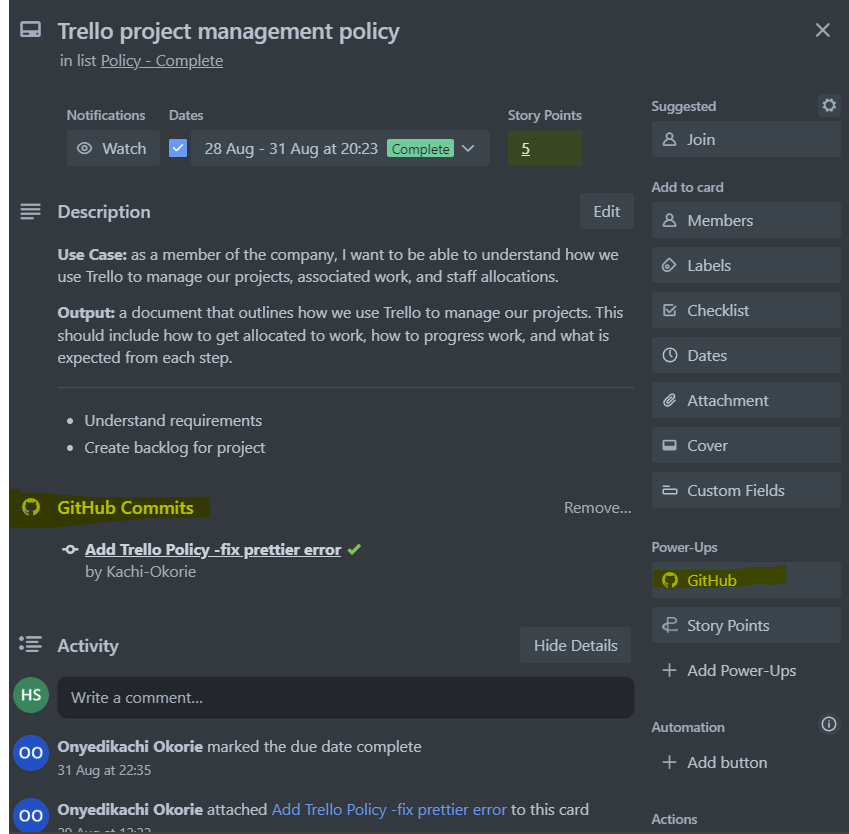

# Project Progress Policy

1. **Introduction**
    The policies and processes for tracking and reporting progress on all of Thoth
    Tech Company's projects are outlined in this project progress policy. The accomplishment of our
    organisational goals and the timely and cost-effective completion of projects depend on
    effective project management. This policy is intended to offer a methodical framework for
    monitoring, evaluating, and sharing project progress.

2. **Purpose**
    Ensure transparency and accountability in project management. Provide a standardized
    method for monitoring project progress. Promote early identification of issues and risks.
    Facilitate effective communication among project stakeholders. Support data-driven
    decision-making.

3. **Responsibilities:**

    **Project Managers/ Team leads** are responsible for:

    - Discussing the project progress plans and schedules.
    - Monitoring project activities and milestones.
    - Identifying and mitigating risks and issues.
    - Providing regular updates to company’s stakeholders.

    **Project Team Members** are responsible for:

    - Each team member (Senior and juniors) should complete the selected project tasks within the
    allocated timeframes.
    - Once team member has completed the assigned task, please create and submit a pull request for the selected task for review. Once the request is cleared the build checks on github and it will need to be approved by the team lead.
    - Keep you Team lead informed on the pull request and get the task reviewed and approved.
    - Team members to ensure Trello board that assigned task are updated with respective pull request
    
    - Reporting any delays, obstacles, or issues to the project manager/ lead.
    - Collaborating with the project manager/ lead to resolve problems.

    For detailed process on Trello please refer to -
    [Trello management policy.md](https://github.com/thoth-tech/Company-Operations/blob/main/Company%20Policy/Trello%20Management%20Policy/Associating%20Cards%20with%20GitHub%20Actions.md) -
    [Github](https://github.com/thoth-tech/Company-Operations/blob/main/Company%20Policy/GitHub%20Company%20Policy.md)

4. **Project Progress Monitoring**

    - Project manager/ lead shall use appropriate project management software/tools (such as Trello)
    to monitor project progress, and project manager/ lead or nominated team member who can update the progress on respective tools used for tracking for progress.
    - For example, on Trello board Add task to be worked on to “Backlog” and once team has selected the task and working on it “In progress” worked on it move it to respective tab like “ Review” and subsequently to “Completed”. 
    - Project progress shall be measured against predefined milestones that is team member are required to complete 5 sprint story point task within a period of 2 weeks.
    - Regular project status meetings shall be conducted to review progress and address any challenges or concerns.

5. **Reporting**
    Project managers/ lead shall provide progress reports/ updates to project stakeholders such as Company Directors, Company's team members, Unit Chair, etc. These reports shall include:

    - Project status (on track, at risk, delayed).
    - Key accomplishments and milestones achieved.
    - Identified risks, issues, and mitigation plans. d. Resource allocation and utilization.
    - Financial status (budget vs. actual expenses) (if needed).
    - Next steps and action items.

    Project progress can be monitored through the task on the Trello board. This will help Company Directors, Team leads, Mentors, others. The project progress can be discussed with the team lead/ mentor during the meeting or on a predefined schedule (e.g., weekly, bi-weekly, or monthly) or as required by the project stakeholders.

6. **Escalation**

    - If a project is significantly delayed, over budget, or faces insurmountable issues, the
      project manager shall escalate the matter to higher management for further action.
    - Executive management shall determine appropriate actions, which may include project
      re-evaluation, restructuring, or termination.

7. **Review and Updates**
    This Project Progress Policy shall be reviewed annually or as needed to ensure its relevance and effectiveness. Any proposed updates or revisions to this policy shall be submitted to the Thoth Tech's Company Operations Core team please refer to Org chart for most recent update for review and approval. For T2 2023 following is the org structure.
    

8. **Conclusion**
    Effective project progress monitoring is essential to the successful execution of projects within Thoth Tech. This policy provides the framework for consistent and transparent
    project progress reporting, ultimately contributing to our organization's success.
